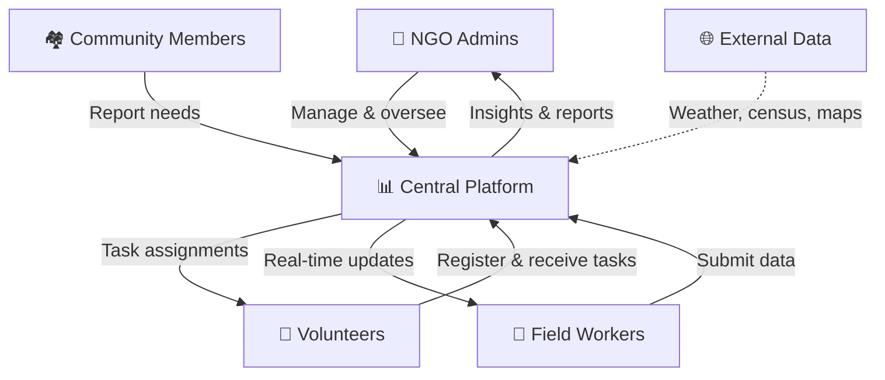
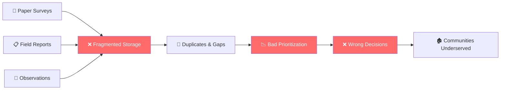
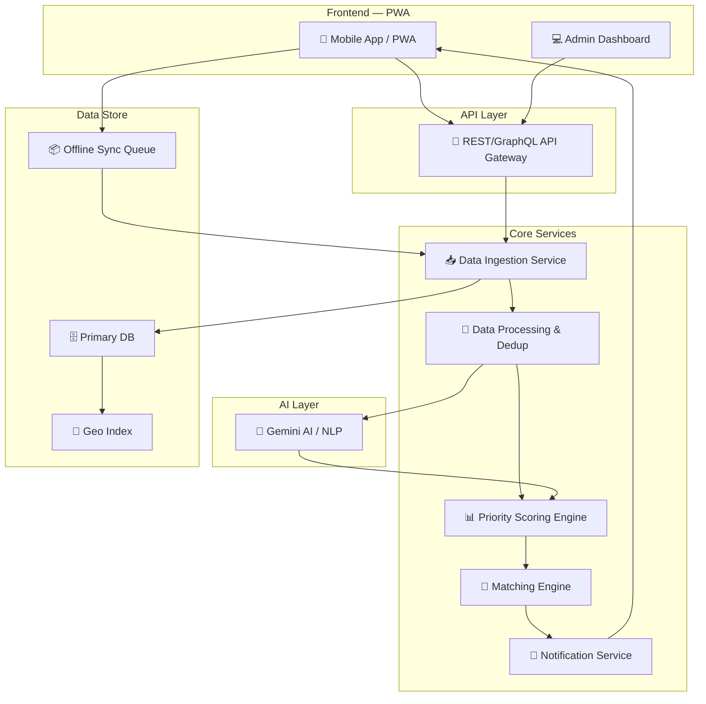

# 🧠 Smart Resource Allocation — Deep Problem Analysis

> **Hackathon**: Google for Developers × Hack2Skill (H2S)
> **Problem Title**: Smart Resource Allocation
> **Subtitle**: Data-Driven Volunteer Coordination for Social Impact
> **Analyst**: Senior Full-Stack Engineer & System Architect

---

## 1. Problem Statement (Verbatim)

> Local social groups and NGOs collect a lot of important information about community needs through paper surveys and field reports. However, this valuable data is often scattered across different places, making it hard to see the biggest problems clearly.

### Objective

> Design a powerful system that gathers scattered community information to clearly show the most urgent local needs. Build a smart way to quickly match and connect available volunteers with the specific tasks and areas where they are needed most.

---

## 2. Decomposing the Problem — Two Core Systems

The problem statement contains **two distinct but interconnected systems**:

### System A: Community Data Aggregation & Prioritization
| Aspect | Detail |
|--------|--------|
| **Input** | Paper surveys, field reports, volunteer observations |
| **Problem** | Data is scattered, fragmented, unstructured, duplicated |
| **Output** | Centralized view of **prioritized community needs** |
| **Key Verb** | "clearly show the most urgent local needs" |

### System B: Smart Volunteer-Task Matching
| Aspect | Detail |
|--------|--------|
| **Input** | Available volunteers (skills, location, availability) + prioritized tasks |
| **Problem** | Manual assignment, poor visibility, no skill-matching |
| **Output** | Optimal volunteer ↔ task assignments |
| **Key Verb** | "quickly match and connect available volunteers" |

> [!IMPORTANT]
> **System A feeds System B.** Without clean, prioritized data, smart matching is impossible. The data pipeline is the foundation.

---

## 3. Stakeholder Map



| Stakeholder | Pain Point | What They Need |
|---|---|---|
| **NGO Admins** | No visibility into data or volunteer status | Dashboard with analytics, priority alerts |
| **Field Workers** | Paper-based, redundant data entry | Mobile-first data capture (offline capable) |
| **Volunteers** | Don't know where/when they're needed | Clear task assignments, notifications |
| **Community** | Problems go unresolved for too long | Faster response to reported issues |

---

## 4. The Data Flow Problem (Root Cause)



> [!CAUTION]
> **"Bad data leads to bad decisions"** — This is the central risk. The entire architecture must be designed around data quality, deduplication, and validation.

---

## 5. Technical Challenges — Ground Reality

### 5.1 Connectivity
| Challenge | Implication |
|---|---|
| Poor/no internet in rural areas | **Offline-first architecture** is mandatory |
| Intermittent connectivity | Need sync queues, conflict resolution |
| Low bandwidth | Lightweight payloads, compressed assets |

### 5.2 User Constraints
| Challenge | Implication |
|---|---|
| Low digital literacy | **Extremely simple UI**, voice input, local language |
| Language barriers | Multi-language support (i18n) |
| Diverse devices | Progressive Web App (PWA), works on low-end phones |

### 5.3 Data Challenges
| Challenge | Implication |
|---|---|
| Unstructured paper data | Need digitization pipeline (OCR/form entry) |
| Duplicate reports | Deduplication logic (geo + time + category) |
| Missing/outdated records | Data validation, expiry, and freshness scores |
| No real-time updates | Event-driven architecture, push notifications |

---

## 6. What "Smart" Means — The AI/ML Angle

The problem says **"smart way to match"** — this signals the need for intelligent algorithms:

### 6.1 Need Prioritization Engine
```
Priority Score = f(severity, affected_population, recency, frequency, resource_gap)
```
- **Severity**: How critical is the issue (health > convenience)
- **Affected Population**: How many people impacted
- **Recency**: When was it reported (decay factor)
- **Frequency**: How often is this reported (validates urgency)
- **Resource Gap**: Are resources already allocated?

### 6.2 Volunteer-Task Matching Algorithm
```
Match Score = f(skill_match, proximity, availability, workload_balance, preference)
```
- **Skill Match**: Volunteer skills vs. task requirements
- **Proximity**: Geographic distance to task location
- **Availability**: Volunteer's free time windows
- **Workload Balance**: Don't overload one volunteer
- **Preference**: Volunteer's stated interests

### 6.3 Gemini AI Integration Opportunities
| Use Case | How |
|---|---|
| **NLP for unstructured data** | Parse free-text field reports into structured categories |
| **Smart summarization** | Summarize community needs for admin dashboards |
| **Predictive insights** | Predict emerging needs based on historical patterns |
| **Chatbot for volunteers** | Natural language task queries ("What can I help with near me?") |
| **Auto-categorization** | Classify incoming reports into need categories |

---

## 7. Functional Requirements Checklist

### 📥 Data Collection Module
- [ ] Mobile-optimized form for field data entry
- [ ] Offline data capture with auto-sync
- [ ] Photo/document upload for paper survey digitization
- [ ] GPS-tagged location for each report
- [ ] Category tagging (health, education, infrastructure, etc.)
- [ ] Multi-language form support

### 📊 Data Aggregation & Analytics Dashboard
- [ ] Centralized view of all community data
- [ ] Deduplication of similar/identical reports
- [ ] Interactive map visualization (heatmap of needs)
- [ ] Priority scoring and ranking of needs
- [ ] Time-series trends
- [ ] Filterable by: region, category, severity, date

### 🤝 Volunteer Management
- [ ] Volunteer registration (skills, availability, location)
- [ ] Volunteer profile and history
- [ ] Availability calendar
- [ ] Skill tagging system
- [ ] Volunteer capacity tracking

### 🔗 Smart Matching Engine
- [ ] Auto-match volunteers to tasks based on scoring
- [ ] Manual override for admins
- [ ] Notification system for new assignments
- [ ] Accept/decline workflow
- [ ] Task status tracking (assigned → in-progress → completed)

### 📱 Notifications & Communication
- [ ] Push notifications for task assignments
- [ ] In-app messaging between admin and volunteers
- [ ] Status update alerts
- [ ] Escalation alerts for unresolved critical needs

---

## 8. Non-Functional Requirements

| Category | Requirement |
|---|---|
| **Performance** | Dashboard loads in < 2s, forms work offline |
| **Scalability** | Support 10K+ reports, 1K+ volunteers |
| **Security** | Role-based access, data encryption |
| **Accessibility** | WCAG 2.1, screen reader support |
| **Availability** | PWA with offline sync |
| **Localization** | Multi-language (Hindi, English, regional) |

---

## 9. Proposed High-Level Architecture



---

## 10. Key Architectural Decisions

| Decision | Choice | Rationale |
|---|---|---|
| **Frontend** | React (Vite) + PWA | Offline support, installable, works on low-end devices |
| **Styling** | Vanilla CSS / Tailwind | Fast, responsive, accessible |
| **State Management** | IndexedDB + Service Workers | Offline-first data persistence |
| **Backend** | Node.js / Express or Python / FastAPI | REST API, fast development |
| **Database** | Firebase Firestore or PostgreSQL | Real-time sync, scalable |
| **AI Integration** | Google Gemini API | NLP, categorization, smart summaries |
| **Maps** | Google Maps / Leaflet.js | Need visualization, geo-heatmaps |
| **Notifications** | Firebase Cloud Messaging | Push notifications, cross-platform |
| **Auth** | Firebase Auth / Google OAuth | Simple, secure, fast setup |

---

## 11. What Judges Will Look For (Hackathon Lens)

> [!TIP]
> This is a **Google for Developers** hackathon. They will evaluate:

| Criteria | What to Demonstrate |
|---|---|
| **Google Tech Usage** | Gemini AI, Firebase, Google Maps, Cloud Run |
| **Innovation** | Smart matching algorithm, NLP for unstructured data |
| **Impact** | Clear metrics — "X% faster response time", "Y fewer gaps" |
| **Completeness** | Working prototype with real data flow |
| **Scalability** | Architecture that can grow beyond hackathon |
| **UI/UX** | Polished, intuitive, accessible interface |
| **Offline Support** | PWA that works in rural areas |

---

## 12. Risk Matrix

| Risk | Probability | Impact | Mitigation |
|---|---|---|---|
| Scope creep (too many features) | High | High | MVP-first, prioritize core flow |
| AI integration complexity | Medium | High | Use Gemini API with pre-built prompts |
| Offline sync conflicts | Medium | Medium | Last-write-wins with admin override |
| Poor data quality from users | High | High | Guided forms, validation, AI cleaning |
| Time constraint | High | High | Focus on 3 core screens, working demo |

---

## 13. Recommended MVP Scope (Hackathon Timeline)

> [!IMPORTANT]
> **For a hackathon, build a compelling demo, not a production system.**

### Must-Have (Core Demo Flow)
1. **Community Need Reporting** — Mobile form to submit needs (offline-capable)
2. **Priority Dashboard** — Map + ranked list of community needs with AI scoring
3. **Smart Volunteer Match** — Auto-assign volunteers to top-priority tasks
4. **Volunteer View** — See assigned tasks, accept/decline, update status

### Nice-to-Have
5. Analytics & trend charts
6. AI chatbot for volunteers
7. Multi-language support
8. Photo-to-data OCR pipeline

### Out of Scope (for now)
- Payment/donation tracking
- Government integration
- Legacy system migration

---

## 14. Summary — The Winning Equation

```
Scattered Data → Centralized + Cleaned → AI-Prioritized Needs
                                              ↓
Available Volunteers → Skill/Location Matched → Smart Assignment
                                              ↓
                                    Faster Community Impact
```

> The platform transforms **reactive, gut-feel decisions** into **data-driven, prioritized action** — connecting the right volunteer to the right need, at the right time, in the right place.

---

*Analysis complete. Ready for architecture design and implementation.*
